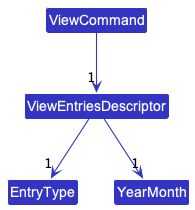
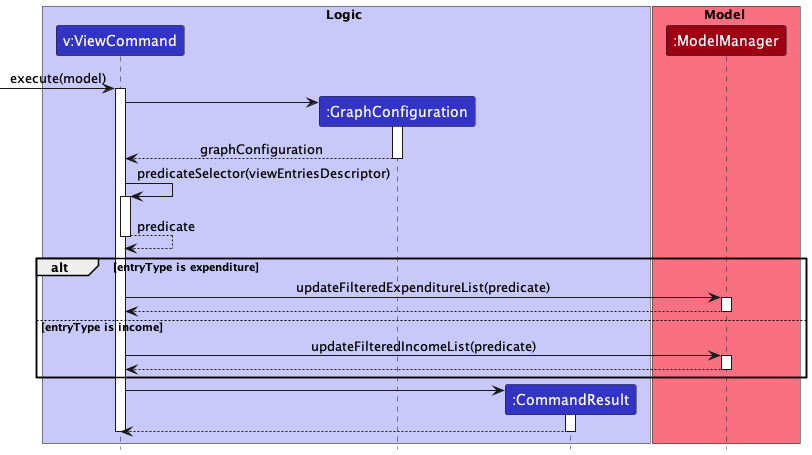
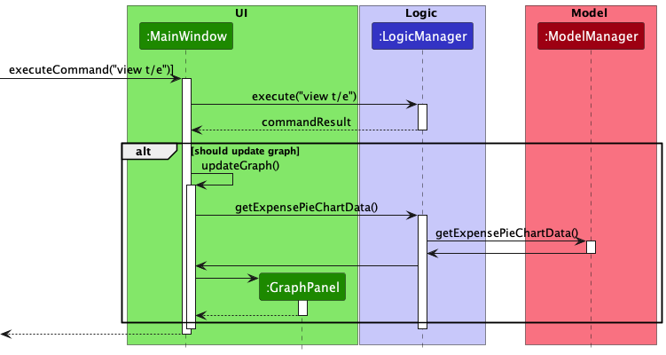
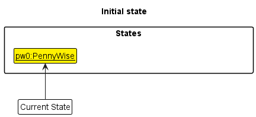
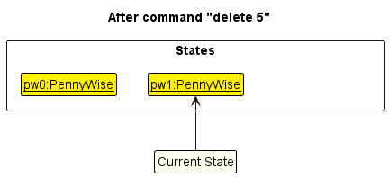
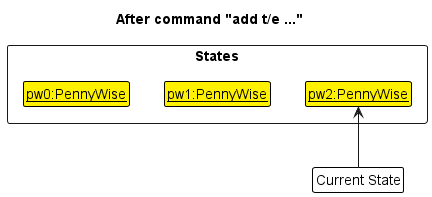
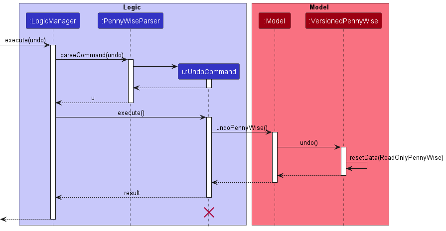
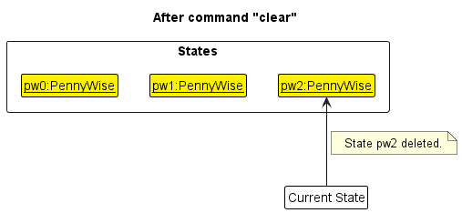

PennyWise is a desktop application that **empowers students with the ability to make informed financial decisions**,
by providing a **graphical analysis of their financial activities**.
It provides a clean Graphical User Interface (GUI) for easy comprehension of expenditure and savings.

# Table of Contents

<!-- TOC -->
  * [**Acknowledgements**](#acknowledgements)
  * [**Setting up, getting started**](#setting-up-getting-started)
  * [**Design**](#design)
    * [Architecture](#architecture)
    * [UI component](#ui-component)
    * [Logic component](#logic-component)
    * [Model component](#model-component)
    * [Storage component](#storage-component)
    * [Common classes](#common-classes)
  * [**Implementation**](#implementation)
    * [Summarise Entries](#summarise-entries)
      * [Design considerations:](#design-considerations)
    * [Add Entry](#add-entry)
      * [Design Considerations](#design-considerations)
    * [Edit Entry](#edit-entry)
    * [\[Proposed\] Undo/redo feature](#proposed-undoredo-feature)
      * [Proposed Implementation](#proposed-implementation)
      * [Design considerations:](#design-considerations)
    * [\[Proposed\] Data archiving](#proposed-data-archiving)
    * [[Proposed\] Pie Chart View feature](#proposed-pie-chart-view-feature)
      * [Implementation](#implementation)
  * [**Documentation, logging, testing, configuration, dev-ops**](#documentation-logging-testing-configuration-dev-ops)
  * [**Appendix: Requirements**](#appendix-requirements)
    * [Product scope](#product-scope)
    * [User stories](#user-stories)
    * [Use cases](#use-cases)
    * [Non-Functional Requirements](#non-functional-requirements)
    * [Glossary](#glossary)
  * [**Appendix: Instructions for manual testing**](#appendix-instructions-for-manual-testing)
    * [Launch and shutdown](#launch-and-shutdown)
    * [Adding an entry](#adding-an-entry)
    * [Deleting an entry](#deleting-an-entry)
    * [Editing an entry](#editing-an-entry)
    * [View PieChart](#view-piechart)
    * [Summary statistics](#summary-statistics)
    * [Saving data](#saving-data)
<!-- TOC -->

--------------------------------------------------------------------------------------------------------------------

## Purpose of Guide

This guide is a comprehensive resource for developing and maintaining PennyWise.

If you are an **experienced developer on PennyWise**, this guide provides a deep-dive into the core [implementation](#implementation) details and design considerations
of several features of the application, allowing you to quickly familiarise yourself with the inner-workings of most parts of the code
architecture and design.
If you are **just getting started**, fret not! The guide gives a quick onboarding on how you can [set up and get started](#setting-up-getting-started).
Once you have the development environment up and running, head over to the [design](#design) section to get a comprehensive
overview of the code design of PennyWise.

If you are in the **customer success team**, you may find the section on [requirements](#appendix-requirements) most helpful to
you on _how_ and _why_ PennyWise came about. It allows you to have a thorough understanding of the [product](#product-scope),
including the [user stories](#user-stories), [use cases](#use-cases) and [non-functional requirements](#non-functional-requirements).

Whether you are a developer or in the customer success team, you may also find it useful to be aware of the [product requirements](#appendix-requirements)
to ensure that we are always developing the finest application and solving the right problems for students. The [glossary](#glossary)
is also helpful if you are unfamiliar with some terms used. Finally, the section on [testing](#appendix-instructions-for-manual-testing)
provides information related to how you can test the application.

    <a href="#top">Back to Top </a>

## How to use this Developer Guide
These are some icons you may see throughout our developer guide.

### Information Box

:information_source: **Note:**
This provides some additional information that you are recommended to know.

### Tip Box

:bulb: **Tip:**
This provides some quick and convenient hacks that you might find useful.

### Danger Box

:exclamation: **Warning**
Danger zone! Do pay attention to the information here carefully.

### Formatting

- `Highlights` are used to denote commands or output from the application.

    <a href="#top">Back to Top </a>

If you are ready, let's [get started](#setting-up-getting-started)!

--------------------------------------------------------------------------------------------------------------------

## **Acknowledgements**

* This project is based on the [AddressBook-Level3 project](https://github.com/se-edu/addressbook-level3) created by the [SE-EDU initiative](https://se-education.org).
* Libraries used: [JavaFX](https://openjfx.io/), [Jackson](https://github.com/FasterXML/jackson), [JUnit5](https://github.com/junit-team/junit5)
* Assets used:
  * PennyWise Application Logo: [Logo Generator](https://logo.com/)
  * Icon(s): [Calendar icon from Streamline](https://www.streamlinehq.com/icons/plump-duo/interface-essential/calendar/interface-calendar)
  * Font: [Poppins Font from Google Fonts](https://fonts.google.com/specimen/Poppins)
  * Theme: [Dark Color Palette from ColorHunt](https://colorhunt.co/palette/2c3333395b64a5c9cae7f6f2)

    <a href="#top">Back to Top </a>

--------------------------------------------------------------------------------------------------------------------

## **Setting up, getting started**

Woohoo! We are excited to help you take your first steps in developing PennyWise.
Please refer to [_Setting up and getting started_](SettingUp.md) to get up and running!

Once you are done, you may check out the [design](#design) section to have a comprehensive overview of how PennyWise
is designed.

    <a href="#top">Back to Top </a>

--------------------------------------------------------------------------------------------------------------------

## **Design**

In this section, we provide a comprehensive and high-level overview of the code architecture and design of PennyWise,
allowing you to easily _familiarise_ yourself with navigating the various aspects of the code and to _build upon_
the existing code base.

In explaining the design approach of the application, there are 6 main aspects:
* [Architecture](#architecture)
* [UI component](#ui-component)
* [Logic component](#logic-component)
* [Model component](#model-component)
* [Storage component](#storage-component)
* [Common classes](#common-classes)

:bulb: **Tip:** The `.puml` files used to create diagrams in this document can be found in
the [diagrams](https://github.com/AY2223S1-CS2103T-W17-2/tp/tree/master/docs/diagrams) folder. Refer to the [_PlantUML
Tutorial_ at se-edu/guides](https://se-education.org/guides/tutorials/plantUml.html) to learn how to create and edit
diagrams.

### Architecture

The ***Architecture*** provides a high-level design of PennyWise and how the various components work together.

**Main components of the architecture**

Here, we provide a quick overview of main components and how they interact with each other.

**`Main`** has two classes
called [`Main`](https://github.com/AY2223S1-CS2103T-W17-2/tp/blob/master/src/main/java/seedu/pennywise/Main.java)
and [`MainApp`](https://github.com/AY2223S1-CS2103T-W17-2/tp/blob/master/src/main/java/seedu/pennywise/MainApp.java). It
is responsible for,

* At app launch: Initializes the components in the correct sequence, and connects them up with each other.
* At shut down: Shuts down the components and invokes cleanup methods where necessary.

[**`Commons`**](#common-classes) represents a collection of classes used by multiple other components.

The rest of the App consists of four components.

* [**`UI`**](#ui-component): The UI of the App.
* [**`Logic`**](#logic-component): The command executor.
* [**`Model`**](#model-component): Holds the data of the App in memory.
* [**`Storage`**](#storage-component): Reads data from, and writes data to, the hard disk.

**How the architecture components interact with each other**

The *Sequence Diagram* below shows how the components interact with each other for the scenario where the user issues
the command `delete 1 t/e`.

Each of the four main components (also shown in the diagram above),

* defines its *API* in an `interface` with the same name as the Component.
* implements its functionality using a concrete `{Component Name}Manager` class (which follows the corresponding
  API `interface` mentioned in the previous point).

For example, the `Logic` component defines its API in the `Logic.java` interface and implements its functionality using
the `LogicManager.java` class which follows the `Logic` interface. Other components interact with a given component
through its interface rather than the concrete class (reason: to prevent outside component's being coupled to the
implementation of a component), as illustrated in the (partial) class diagram below.

Ready to take your next steps? Read on to find out more about each of the components:
* [UI component](#ui-component)
* [Logic component](#logic-component)
* [Model component](#model-component)
* [Storage component](#storage-component)
* [Common classes](#common-classes)

### UI component

The UI component is responsible for handling the interactions on the user-interface.

The **API** of this component is specified
in [`Ui.java`](https://github.com/AY2223S1-CS2103T-W17-2/tp/blob/master/src/main/java/seedu/pennywise/ui/Ui.java)

The UI consists of a `MainWindow` that is made up of parts e.g. `CommandBox`, `ResultDisplay`, `EntryPane`
, `StatusBarFooter` etc. All these, including the `MainWindow`, inherit from the abstract `UiPart` class which captures
the commonalities between classes that represent parts of the visible GUI.

The `UI` component uses the JavaFx UI framework. The layout of these UI parts are defined in matching `.fxml` files that
are in the `src/main/resources/view` folder. For example, the layout of
the [`MainWindow`](https://github.com/AY2223S1-CS2103T-W17-2/tp/blob/master/src/main/java/seedu/pennywise/ui/MainWindow.java)
is specified
in [`MainWindow.fxml`](https://github.com/AY2223S1-CS2103T-W17-2/tp/blob/master/src/main/resources/view/MainWindow.fxml)

The `UI` component,

* executes user commands using the `Logic` component.
* listens for changes to `Model` data so that the UI can be updated with the modified data.
* keeps a reference to the `Logic` component, because the `UI` relies on the `Logic` to execute commands.
* depends on some classes in the `Model` component, as it displays `Entry` object residing in the `Model`.

### Logic component

The Logic component is the _brain_ of the application and handles how commands from the users are parsed and executed.

**API** : [`Logic.java`](https://github.com/AY2223S1-CS2103T-W17-2/tp/blob/master/src/main/java/seedu/pennywise/logic/Logic.java)

Here's a (partial) class diagram of the `Logic` component:

How the `Logic` component works:

1. When `Logic` is called upon to execute a command, it uses the `PennyWiseParser` class to parse the user command.
1. This results in a `Command` object (more precisely, an object of one of its subclasses e.g., `AddCommand`) which is
   executed by the `LogicManager`.
1. The command can communicate with the `Model` when it is executed (e.g. to add an entry).
1. The result of the command execution is encapsulated as a `CommandResult` object which is returned from `Logic`.

The Sequence Diagram below illustrates the interactions within the `Logic` component for the `execute("delete 1 t/e")` API
call.

:information_source: **Note:** The lifeline for `DeleteCommandParser` should end at the destroy marker (X) but due to a limitation of PlantUML, the lifeline reaches the end of diagram.

Here are the other classes in `Logic` (omitted from the class diagram above) that are used for parsing a user command:

How the parsing works:

* When called upon to parse a user command, the `PennyWiseParser` class creates an `XYZCommandParser` (`XYZ` is a
  placeholder for the specific command name e.g., `AddCommandParser`) which uses the other classes shown above to parse
  the user command and create a `XYZCommand` object (e.g., `AddCommand`) which the `PennyWiseParser` returns back as
  a `Command` object.
* All `XYZCommandParser` classes (e.g., `AddCommandParser`, `DeleteCommandParser`, ...) inherit from the `Parser`
  interface so that they can be treated similarly where possible e.g, during testing.

### Model component

The Model component is in charge of managing the entities in the application.

**API** : [`Model.java`](https://github.com/AY2223S1-CS2103T-W17-2/tp/blob/master/src/main/java/seedu/pennywise/model/Model.java)

The `Model` component,

* stores the application data i.e., all `Entry` objects (which are contained in a `UniqueEntryList` object).
* stores the currently 'selected' `Entry` objects (e.g., results of a search query) as a separate _filtered_ list which
  is exposed to outsiders as an unmodifiable `ObservableList<Entry>` that can be 'observed' e.g. the UI can be bound to
  this list so that the UI automatically updates when the data in the list change.
* stores a `UserPref` object that represents the user’s preferences. This is exposed to the outside as
  a `ReadOnlyUserPref` objects.
* does not depend on any of the other three components (as the `Model` represents data entities of the domain, they
  should make sense on their own without depending on other components)

### Storage component

The Storage component helps to provide data-storage facilities, allowing data in the application to be stored securely.

**API** : [`Storage.java`](https://github.com/AY2223S1-CS2103T-W17-2/tp/blob/master/src/main/java/seedu/pennywise/storage/Storage.java)

The `Storage` component,

* can save both application data and user preference data in json format, and read them back into corresponding
  objects.
* inherits from both `PennyWiseStorage` and `UserPrefStorage`, which means it can be treated as either one (if only
  the functionality of only one is needed).
* depends on some classes in the `Model` component (because the `Storage` component's job is to save/retrieve objects
  that belong to the `Model`)

### Common classes

Classes used by multiple components are in the [`seedu.pennywise.commons`](https://github.com/AY2223S1-CS2103T-W17-2/tp/tree/master/src/main/java/seedu/pennywise/commons) package.

    <a href="#top">Back to Top </a>

--------------------------------------------------------------------------------------------------------------------

## **Implementation**

This section describes some noteworthy details on how certain features are implemented, as well as the considerations that goes behind the implementations.
You can also find some of our proposed implementations for challenging features that we will focus on in later iterations.

### Summarise Entries

The `summary` feature provides 3 simple statistic, including the total expenditure, total income and total balance,
helping students to have a quick overview of their expenditure and income. If the command is optionally provided with a
year and month field, the summary statistics will be contained to only the entries occurring in the specified year and month.

#### How the `summary` command works

The `summary` command is implemented by the `SummaryCommandParser` and `SummaryCommand` classes.

`SummaryCommandParser` class is responsible for parsing the parameter received from the user.

`SummaryCommand` class is responsible for generating the summary statistic for the specified duration.

Below is a sequence diagram and explanation of how the `summary` command is executed.

:information_source: **Note:** The lifeline for `SummaryCommandParser` should end at the destroy marker (X) but due to a limitation of PlantUML, the lifeline reaches the end of diagram.

1. The user enters `summary mo/2022-08` command in the main window

2. The command is handled by `LogicManager#execute` method,
which then calls the `PennyWiseParser#parseCommand` method

3. The `PennyWiseParser` matches the word summary in the string and extracts the argument string `mo/2022-08`

4. The `PennyWiseParser` then calls `SummaryCommandParser#parse` method
and the argument string is converted to a List

5. The `SummaryCommandParser` creates a new `EntryInYearMonthPredicate` instance to handle the filter

6. The `SummaryCommandParser` creates a new `SummaryCommand` instance with the `EntryInYearMonthPredicate` instance and
returns it to `PennyWiseParser`, which in turn returns to `LogicManger`.

7. The `LogicManager` calls the `SummaryCommand#execute` method.

8. The `SummaryCommand` calls the `Model#updateFilteredEntry` method and
filters the income and expenditure entries by the month

9. The application calculates the summary statistics for the filtered income and expenditure entries.

10. The `SummaryCommand` then creates a `CommandResult` and returns it to `LogicManager`.

#### Design considerations:
* **Alternative 1 (current choice):** Only allow users to generate summary statistic either by month or all entries
  * Pros: Easier to implement. The statistics by month is also logical as
  users will generally budget based on a monthly basis
  * Cons: Users will not be able to customise the scope of the summary
  statistic further (e.g. summarising entries for the past week)

* **Alternative 2:** Provide the option to specify a start and end date to generate summary statistic
  * Pros: Allows more customisation to the scope of the summary statistics
  * Cons: Harder to implement and the command will be more complex as it will require more parameters

### Add Entry

The `add` command allows students to add their expenses or income entries into PennyWise.

### How the `add` command works

The `add` command is implemented by the `AddCommandParser` and `AddCommand` classes.

`AddCommandParser` class is responsible for parsing the parameter received from the user.

`AddCommand` class is responsible for adding a new entry to the specified list.

Below is a sequence diagram and explanation of how the `add` command is executed.

:information_source: **Note:** The lifeline for `AddCommandParser` should end at the destroy marker (X) but due to a limitation of PlantUML, the lifeline reaches the end of diagram.

1. The user enters `add t/e d/Lunch a/7.20 da/04-10-2022 c/Food` command in the main window.

2. The command is handled by `LogicManager#execute` method, which then calls the `PennyWiseParser#parseCommand`method.

3. The `PennyWiseParser` matches the entry details in the string and extracts the argument string `t/e d/Lunch a/7.20 da/04-10-2022 c/Food`.

4. The `PennyWiseParser` then calls `AddCommandParser#parse` method and the argument string is converted to a List.

5. The `AddCommandParser` then creates a new instances of arguments needed for an Entry: `EntryType`, `Description`, `Amount`, `Date`, `Category`.

6. The `AddCommandParser` uses the new instances to create a new instance of `Entry`, depending on the `EntryType` specified.

7. The `AddCommandParser` creates a new `AddCommand` instance with the new `Entry` instance and returns it to `PennyWiseParser`, which in turns returns to `LogicManager`.

8. The `LogicManager` calls the `AddCommand#execute` method.

9. The `AddCommand` calls the `Model#addExpenditure` or `Model#addIncome` method and adds the new entry to the specified list.

10. The `AddCommand` then creates a `CommandResult` instance and returns it to `LogicManager`.

#### Design Considerations
* **Alternative 1 (current choice):** Only allow users to create an entry with 1 type of category
  * Pros: Users are able to distinctly sort their expenditures/incomes into specific pre-determined categories.
  * Cons: Users would not be able to specify expenditures/incomes under their own categories.

* **Alternative 2:** Allow users to specify their own categories.
  * Pros: Users can be more flexible in grouping their expenditures/incomes.
  * Cons: Possible dilution of categories, which would make the pie chart diagram not as useful.

### Edit Entry

The `edit` command allows students to make changes to the description, date, amount or category of existing expenditure and income entries.

#### How the `edit` command works

The `edit` command is implemented by the `EditCommandParser` and `EditCommand` classes.

`EditCommandParser` class is responsible for parsing the parameter received from the user.

`EditCommand` class is responsible for editing an existing entry in the application.

Below is a sequence diagram and explanation of how the `EditCommand` is executed.

:information_source: **Note:** The lifeline for `EditCommandParser` should end at the destroy marker (X) but due to a limitation of PlantUML, the lifeline reaches the end of diagram.

1. The user enters `edit 1 t/e d/LunchDeck` command in the main window.

2. The command is handled by `LogicManager#execute` method, which then calls the `PennyWiseParser#parseCommand`method.

3. The `PennyWiseParser` matches the entry details in the string and extracts the argument string `1 t/e d/LunchDeck`.

4. The `PennyWiseParser` then calls `EditCommandParser#parse` method and the argument string is converted to a List.

5. The `EditCommandParser` then creates a new instance of the `EditEntryDescriptor` to describe the fields to be updated: `EntryType`, `Description`, `Amount`, `Date`, `Category`.

6. The `EditCommandParser` creates a new `EditCommand` instance with the `EditEntryDescriptor` instance and returns it to `PennyWiseParser`, which in turns returns to `LogicManager`.

7. The `LogicManager` calls the `EditCommand#execute` method.

8. The `EditCommand` calls the `Model#getFilteredExpenditureList` method to retrieve the list of expenditure entries.

9. The `EditCommand` invokes the `EditCommand#getEntryToEdit` method to get the entry to be edited, then creates a new instance of the edited entry using `EditCommand#createdEditedEntry`.

10. The `EditCommand` then calls the `Model#setExpenditure` method to update the expenditure.

11. The `EditCommand` eventually creates a `CommandResult` instance and returns it to `LogicManager`.

### View Pie Charts and Line Graphs

#### How the `view` command works

:information_source: **Note:** The command syntax for view command is as follows:
`view t/ENTRY_TYPE [mo/MONTH]`
E.g. `view t/e` produces a pie chart view of the expenses entries grouped by categories.
`view t/i mo/2022-01` produces a line graph of the income entries in Jan 2022 grouped by days.

`view` command is used to filter the entry list as well as generate graphs.

The `ViewCommandParser` class is responsible for parsing the parameter received from the user, and passing the `EntryType`
as well as `GraphType` to the `ViewCommand` class.

The `ViewCommand` class is responsible for filtering the entry list and generating the correct `GraphConfiguration`.

The class diagram below shows the structure of `ViewCommand`.

The `view` command will produce a category view with a pie chart or a daily view with a line graph. This is achieved with an optional
input `mo/MONTH`. If it is present, the entry list will be filtered by the specified month and
a line graph will be displayed. Otherwise, the full list will be shown and a pie chart will be displayed.

The activity diagram below illustrates the workflow described above when a user executes the `view` command.

Given below is an example usage scenario and how the pie chart view mechanism behaves at each step.
The two sequence diagrams below omit the parsing workflow as it is identical to the rest of the command. They only highlight
the steps in **command execution** as well as **UI updates**.

1. The user types `view t/e` command in the main window.

2. This command is handled by `MainWindow#executeCommand` method, which then calls the `LogicManager#execute` method.

3. `LogicManager` then calls the `pennyWiseParser#parseCommand` method which matches the command word `view` in the string and extracts the arguments string `t/e`.

4. `pennyWiseParser` then calls the `ViewCommandParser#parse` method.
   In this method, it is ensured that the input is of the correct format, and the entry type (and year month, if supplied) is extracted.
   It creates a `viewEntriesDescriptor` with `entryType` set to expenditure and `yearMonth` set to `null`.
5. `LogicManager`then calls the `ViewCommand#execute` method which creates a `graphConfiguration` based on the `viewEntriesDescriptor`. It also filters the
expenditure list based on `predicate` generated from the `viewEntriesDescriptor`.
The `CommandResult`, containing the `graphConfiguration`, is returned to `LogicManager` and passed to `MainWindow`.

6. `MainWindow` checks the `commandResult` which indicates a need to update graph. It then calls the `updateGraph` method which renders the graph according to the `graphConfiguration`.

7. In `updateGraph`, `LogicManager#getExpensePieChartData` calls `ModelManager#getPieChartData` which returns the `pieChartData`.
   It then creates a new `GraphPanel` with the `pieChartData` and add it to the UI.

Design considerations:
* **Alternative 1:** The charts update only after `view` command.
    * Pros: Easy to extend since we are adding more graph representation of data later such as bar graphs.
    * Cons: Not responsive to changes in data, for instance if the user adds an entry, the pie chart will not be automatically updated.
* **Alternative 2:** The charts update immediately after changing tabs between expenses and income.
    * Pros: Intuitive, simple and quick for user.
    * Cons: Difficult to extend to other graph types as user might prefer other graph representations.

The current design follows a modified version of Alternative 2. Whenever the tab is toggled manually by users, all filters
will be reset and a pie chart will be displayed. We followed this design for the following reasons:
* The UI is still responsive to users' tab switching action.
* Setting a filter for one list with `view t/ENTRY_TYPE mo/MONTH` would not affect the other list, because to show the other list,
the user needs to either use a `view` command, which sets a filter for the other list, or switch tab manually, which is equivalent
to a `view t/ENTRY_TYPE` command.

### \[Proposed\] Undo/redo feature

#### Proposed Implementation

The proposed undo/redo mechanism is facilitated by `VersionedPennyWise`. It extends `PennyWise` with an undo/redo
history, stored internally as an `pennyWiseStateList` and `currentStatePointer`. Additionally, it implements the
following operations:

* `VersionedPennyWise#commit()` — Saves the current PennyWise state in its history.
* `VersionedPennyWise#undo()` — Restores the previous PennyWise state from its history.
* `VersionedPennyWise#redo()` — Restores a previously undone PennyWise state from its history.

These operations are exposed in the `Model` interface as `Model#commitPennyWise()`, `Model#undoPennyWise()`
and `Model#redoPennyWise()` respectively.

Given below is an example usage scenario and how the undo/redo mechanism behaves at each step.

1. The user launches the application for the first time. The `VersionedPennyWise` will be initialized with the
initial PennyWise state, and the `currentStatePointer` pointing to that single PennyWise state.

2. The user executes `delete 5` command to delete the 5th entry in the application. The `delete` command
calls `Model#commitPennyWise()`, causing the modified state of the application after the `delete 5` command executes
to be saved in the `pennyWiseStateList`, and the `currentStatePointer` is shifted to the newly inserted PennyWise
state.

3. The user executes `add t/e …​` to add a new entry. The `add` command also calls `Model#commitPennyWise()`
, causing another modified PennyWise state to be saved into the `pennyWiseStateList`.

:information_source: **Note:** If a command fails its execution, it will not call `Model#commitPennyWise()`, so the application state will not be saved into the `pennyWiseStateList`.

4. The user now decides that adding the entry was a mistake, and decides to undo that action by executing
the `undo` command. The `undo` command will call `Model#undoPennyWise()`, which will shift the `currentStatePointer`
once to the left, pointing it to the previous application state, and restores the application to that state.

:information_source: **Note:** If the `currentStatePointer` is at index 0, pointing to the initial PennyWise state, then there are no previous PennyWise states to restore. The `undo` command uses `Model#canUndoPennyWise()` to check if this is the case. If so, it will return an error to the user rather
than attempting to perform the undo.

The following sequence diagram shows how the undo operation works:

:information_source: **Note:** The lifeline for `UndoCommand` should end at the destroy marker (X) but due to a limitation of PlantUML, the lifeline reaches the end of diagram.

The `redo` command does the opposite — it calls `Model#redoPennyWise()`, which shifts the `currentStatePointer` once
to the right, pointing to the previously undone state, and restores the application to that state.

:information_source: **Note:** If the `currentStatePointer` is at index `pennyWiseStateList.size() - 1`, pointing to the latest PennyWise state, then there are no undone PennyWise states to restore. The `redo` command uses `Model#canRedoPennyWise()` to check if this is the case. If so, it will return an error to the user rather than attempting to perform the redo.

5. The user executes `clear`, which calls `Model#commitPennyWise()`. Since the `currentStatePointer` is not
pointing at the end of the `pennyWiseStateList`, all application states after the `currentStatePointer` will be
purged. Reason: It no longer makes sense to redo the `add t/e …​` command. This is the behavior that most modern
desktop applications follow.

The following activity diagram summarizes what happens when a user executes a new command:

#### Design considerations:

**Aspect: How undo & redo executes:**

* **Alternative 1 (current choice):** Saves the entire penny wise.
    * Pros: Easy to implement.
    * Cons: May have performance issues in terms of memory usage.

* **Alternative 2:** Individual command knows how to undo/redo by itself.
    * Pros: Will use less memory (e.g. for `delete`, just save the entry being deleted).
    * Cons: We must ensure that the implementation of each individual command are correct.

_{more aspects and alternatives to be added}_

--------------------------------------------------------------------------------------------------------------------

## **Documentation, logging, testing, configuration, dev-ops**

* [Documentation guide](Documentation.md)
* [Testing guide](Testing.md)
* [Logging guide](Logging.md)
* [Configuration guide](Configuration.md)
* [DevOps guide](DevOps.md)

    <a href="#top">Back to Top </a>

--------------------------------------------------------------------------------------------------------------------

## **Appendix: Requirements**

In this section, we share some thought-process behind starting and developing PennyWise.
In particular, this encompasses:

* [Product scope](#product-scope)
* [User stories](#user-stories)
* [Use cases](#use-cases)
* [Non-Functional Requirements](#non-functional-requirements)
* [Glossary](#glossary)

### Product scope

Here, we share the target user profile and the value proposition of PennyWise, which can aid you in having a better
understanding of how our features __fit together__ a cohesive product and how it matches our target user.

**Target user profile**:

Tertiary students who:
* has a need to manage a significant number of expenditures or income streams
* prefer desktop apps over other types
* can type fast
* prefers typing to mouse interactions
* is reasonably comfortable using CLI apps

**Value proposition**:

PennyWise empowers tertiary students with the ability to make informed financial decisions by providing a graphical analysis of their financial activities.
This allows students to easily identify categories they are overspending on and spot trends in their spending patterns,
allowing them to zone in on which aspect to cut down on.
Furthermore, PennyWise also helps students to keep track of their income streams, making it fast and convenient for them to juggle
their budget.

### User stories

Here, we list some user stories of the application so that you can better understand how the application can be used from the user's perspective.

:information_source: **What is a user story?**
User stories are short, simple descriptions of a feature told from the perspective of the person who desires the new capability, usually a user or customer of the system.

(adapted from [CS2103T Notes](https://nus-cs2103-ay2223s1.github.io/website/schedule/week5/topics.html#user-stories))

Priorities:
* High (must have) - `HIGH`
* Medium (nice to have) - `MEDIUM`
* Low (unlikely to have) - `LOW`

| **Priority** | **As a...**                          | **I want to...**                                        | **So that I can...**                                           |
|--------------|--------------------------------------|---------------------------------------------------------|----------------------------------------------------------------|
| `HIGH`       | student                              | add a new expense/income entry                          | keep track of the details of my expenditures/incomes           |
| `HIGH`       | student                              | delete an existing expense/income entry                 | remove an expense/income entry that I do not need to track     |
| `HIGH`       | student                              | view all my expenses/income                             | get an overview of all my expenses/income                      |
| `HIGH`       | student                              | summarize my expenses/income                            | easily decide on how to adjust my spending                     |
| `MEDIUM`     | student                              | edit any mistakes in my expenses/income entries         | correctly log my budgeting                                     |
| `MEDIUM`     | student who spends a lot             | determine areas where I am spending the most on         | zone in on the appropriate areas to cut down my spending       |
| `MEDIUM`     | student who spends a lot             | categorize my expense entries                           | have a finer overview of my expense entries                    |
| `MEDIUM`     | student with multiple income streams | categorize my income entries                            | have a finer overview of my income entries                     |
| `MEDIUM`     | organised student                    | filter my expenses by tags                              | have an overview of the areas where I spent                    |
| `MEDIUM`     | organised student                    | filter my incomes by tags                               | have an overview of the areas where I am earning               |
| `MEDIUM`     | organised student                    | filter my expenses by date range                        | identify trends and patterns in my spending habits             |
| `MEDIUM`     | organised student                    | filter my incomes by date range                         | identify trends and patterns in my income streams              |
| `MEDIUM`     | potential user                       | see example data in the application                     | see how the application works                                  |
| `LOW`        | visual learner                       | view my expenses/income using different types of graphs | better visualisation of my spending/income patterns and habits |
| `LOW`        | forgetful student                    | view a list of commands and how to use them             | refer to it when I forget the commands                         |
| `LOW`        | forgetful student                    | have a list of prompts for commands when I am typing    | avoid having to constantly refer to the user guide             |

### Use cases

Here, we list some use cases of the application.

:information_source: **What is a use case?**
A use case describes an interaction between the user and the system for a specific functionality of the system.

(adapted from [CS2103T Notes](https://nus-cs2103-ay2223s1.github.io/website/schedule/week7/topics.html#W7-1))

:information_source: **Note:**
For all use cases below, the **System** is the `PennyWise` and the **Actor** is the `User`, unless specified
otherwise, for all **Entries**, they can only be of type `expenditure` or `income`.

**Use case: UC1 - Add an entry**

**MSS**

1. User requests to add an entry
2. PennyWise adds the entry to the specified list
3. PennyWise shows updated list with new entry added

   Use case ends.

**Extensions**

* 1a. The given command has an invalid syntax.

    * 1a1. PennyWise shows an error message.

      Use case resumes at step 1.

**Use case: UC2 - Delete an entry**

**MSS**

1. User requests to list entries
2. PennyWise shows requested list of entries
3. User requests to delete a specific entry in the list
4. PennyWise deletes the entry
5. PennyWise shows updated list

   Use case ends.

**Extensions**

* 2a. The list is empty.

  Use case ends.

* 3a. The given command has an invalid syntax.

    * 3a1. PennyWise shows an error message.

      Use case resumes at step 1.

**Use case: UC3 - Edit an entry**

**MSS**

1. User requests to list entries
2. PennyWise shows requested list of entries
3. User requests to edit a specific entry in the list
4. PennyWise edits the entry
5. PennyWise shows updated list

   Use case ends.

**Extensions**

* 2a. The list is empty.

  Use case ends.

* 3a. The given command has an invalid syntax.

    * 3a1. PennyWise shows an error message.

      Use case resumes at step 1.

**Use case: UC4 - Viewing a list**

**MSS**

1. User requests to list entries
2. PennyWise shows requested list of entries
3. PennyWise shows graphical overview of entries

   Use case ends.

**Extensions**

* 2a. The list is empty.

  Use case ends.

* 3a. The given command has an invalid syntax.

    * 3a1. PennyWise shows an error message.

      Use case resumes at step 1.

**Use case: UC5 - Summarizing statistics**

**MSS**

1. User requests to view summary
2. PennyWise shows calculated summary of entries
3. PennyWise shows graphical summary of entries

   Use case ends.

**Extensions**

* 2a. The list is empty.

  Use case ends.

**Use case: UC6 - Clearing the application**

**MSS**

1. User requests to clear entries in PennyWise
2. PennyWise clears all entries from both lists

   Use case ends.

**Use case: UC7 - Exiting the application**

**MSS**

1. User requests to exit the application
2. PennyWise exits

   Use case ends.

**Use case: UC8 - View help**

**MSS**

1. User requests to view help
2. PennyWise displays a pop-up window with a link to the user guide

   Use case ends.

### Non-Functional Requirements

1. **Technical requirements**: The system should work on any _mainstream OS_ as long as it has Java `11` or above installed.
2. **Performance requirements**: The system should be able to hold up to 1000 expenses entries and 1000 income entries without a noticeable sluggishness in performance for typical usage.
3. **Performance requirements**: The system should respond within two seconds.
4. **Quality requirements**: A user with above average typing speed for regular English text (i.e. not code, not system admin commands) should be
   able to accomplish most of the tasks faster using commands than using the mouse.
5. **Quality requirements**: The system should be easily usable by a novice who has never managed budgeting without having to constantly refer to the user guide.
6. **Data Requirements**: Data should be persisted within the user's file system only.
7. **Documentation**: The User Guide should be directed towards self-help for users, so that they are able to understand how to use the application and recover from mistakes.
8. The user interface should be self-explanatory as much as possible for users who are not IT-savvy without having to constantly refer to the user guide.
9. The source code should be open source.
10. The product is offered as a free online service.

### Glossary

In the Glossary, we provide our definitions for some commonly-used terms that you can find throughout the application.

* **Mainstream OS**: Windows, Linux, Unix, macOS
* **Entry**: An entry refers to either an expenditure or income

    <a href="#top">Back to Top </a>

--------------------------------------------------------------------------------------------------------------------

## **Appendix: Instructions for manual testing**

Given below are instructions to test the app manually.

:information_source: **Note:** These instructions only provide a starting point for testers to work on;
testers are expected to do more *exploratory* testing.

### Launch and shutdown

1. Initial launch

    1. Download the jar file and copy into an empty folder

    1. Double-click the jar file Expected: Shows the GUI with a set of sample contacts. The window size may not be
       optimum.

1. Saving window preferences

    1. Resize the window to an optimum size. Move the window to a different location. Close the window.

    1. Re-launch the app by double-clicking the jar file. 
       Expected: The most recent window size and location is retained.

### Adding an entry

1. Adding an entry while all entries are being shown

    1. Prerequisites: None

    1. Test case: `add t/e d/Lunch a/7.20 da/04-10-2022 c/Food` 
       Expected: Entry is added to the expenditure list. Details of the added entry shown in the status message.

    1. Test case: ``add t/e d/Lunch a/$7.20 da/04-10-2022 c/Food ... `` 
       Expected: No entry is added. Error details shown in the status message on amount formatted to 2 decimal places.

    1. Test case: `add d/Lunch a/7.20 da/04-10-2022 c/Food` 
       Expected: No entry is added. Error details shown in the status message.

    1. Other incorrect delete commands to try: `add`, `add da/15-Feb-2022`, `add x`, `...` (where x a string that does not follow the command format)  
       Expected: Similar to previous.

### Deleting an entry

1. Deleting an entry while all entries are being shown

    1. Prerequisites: At least 1 entry in the specified list.

    1. Test case: `delete 1 t/e` 
       Expected: First expenditure entry is deleted from the list. Details of the deleted entry shown in the status message.
       Timestamp in the status bar is updated.

    1. Test case: `delete 0 t/e` 
       Expected: No entry is deleted. Error details shown in the status message. Status bar remains the same.

    1. Other incorrect delete commands to try: `delete`, `delete x t/e`, `...` (where x is larger than the list size),
       `delete 1 y` (where y is a string that does not follow the command format)  
       Expected: Similar to previous.

### Editing an entry

1. Editing an entry while all entries are being shown

    1. Prerequisites: At least 1 entry in the specified list.

    1. Test case: `edit 1 t/e d/Edited Description` 
       Expected: First expenditure entry is edited from the list. Details of the edited entry shown in the status message.

    1. Test case: `edit 0 t/e d/Edited Description` 
       Expected: No entry is edited. Error details shown in the status message.

    1. Other incorrect delete commands to try: `edit`, `edit x t/e`, `...` (where x is larger than the list size),
    `edit 1 y` (where y is a string that does not follow the command format) 
       Expected: Similar to previous.

### View PieChart

1. Viewing the PieChart for a list of entry

    1. Prerequisites: At least 1 entry in the specified list.

    1. Test case: `view t/e g/c` 
       Expected: Updated PieChart of expenditures is displayed. Success details shown in the status message.

    1. Test case: `view t/e` 
       Expected: Old Diagram remains shown. Error details shown in the status message.

    1. Other incorrect delete commands to try: `view`, `view x`, `...` (where x is a string that does not follow the command format) 
       Expected: Similar to previous.

### Summary statistics

1. Viewing the PieChart for a list of entry

    1. Prerequisites: Multiple entries in expenditure and income lists.

    1. Test case: `summary` 
       Expected: Status message shows the total expenditure, total income and total balance.

    1. Test case: `summary da/01-10-2022` 
       Expected: Status message shows the total expenditure, total income and total balance for the 01-10-2022

    1. Other correct summary commands to try: `summary da/x`, `...` (where x is a string that follows the date format) 
       Expected: Similar to previous, but for the specific date `x`.

    1. Other incorrect delete commands to try: `summary x`, `...` (where x is a string that does not follow the command format) 
       Expected: Error details shown in the status message.

    <a href="#top">Back to Top </a>

